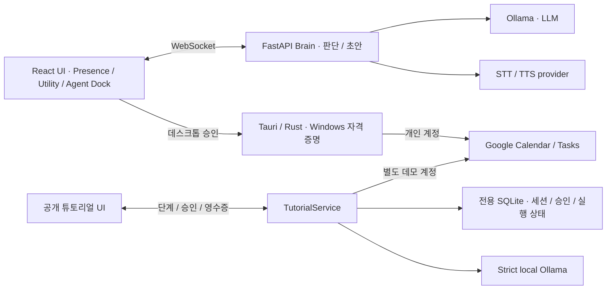

# Architecture

Tanya는 사용자의 주의를 끄는 시점과 외부 변경 권한을 인터페이스에 드러내는 상주형 AI 동반자입니다. 이 문서는 스냅샷에 포함된 코드의 책임과 구현 경계를 설명합니다.

## 구성

Live2D는 Client의 선택적 표현 영역입니다. 모델과 Core가 설정되지 않으면 해당 영역을 비활성화합니다. 렌더링 자산이 없다는 이유로 채팅·튜토리얼·승인 화면을 중단하지 않습니다.

## 다섯 계약

| 계약 | 코드에서 추구하는 동작 |
| --- | --- |
| Presence | 조용한 기본 화면에서 필요할 때 대화·도구 화면으로 확장 |
| Grounding | 제안 이유, 사용 데이터와 시각, 실행 대상 설명 |
| Consent-first Action | 제안 수락과 외부 실행 승인을 분리하고 변경 내용 미리보기 |
| Local Authority | 데스크톱 개인 Google 자격 증명과 API 실행을 Windows Client에 유지 |
| Execution Receipt | 실제 실행 결과와 provider 식별자로 확인 가능한 결과 표시 |

이는 제품 기준입니다. 경로별로 구현된 보장 수준이 같다고 가정하지 않습니다.

## 데스크톱 권한 경계

[App](../packages/client/src/App.tsx)이 초안과 승인 UI를 연결하고, [Rust Google 연동](../packages/client/src-tauri/src/google.rs)이 OAuth PKCE, Windows 자격 증명 저장소, Calendar/Tasks API 호출을 담당합니다. Brain·LLM에 개인 Google 토큰을 전달하여 실행시키는 구조가 아닙니다.

성공한 요청의 영수증은 request ID로 저장하여 다시 사용할 수 있습니다. 다만 외부 POST와 로컬 영수증 저장 사이의 중단을 영속적으로 복구하는 in-flight ledger는 없습니다. 따라서 데스크톱의 모든 장애 상황에서 정확히 한 번 실행된다고 보장하지 않습니다.

## 공개 튜토리얼 권한 경계

익명 방문자는 자신의 Google 계정을 연결하지 않습니다. 선택적으로 구성한 **별도 데모 계정**으로 서버가 실행하며, 이 경로를 데스크톱의 개인 권한 모델과 구분합니다.

- [TutorialService](../packages/brain/tutorial/service.py): 단계 순서, 미리보기, 승인, 외부 호출, 영수증과 삭제 처리.
- [TutorialStore](../packages/brain/tutorial/store.py): 세션 소유자, 일회성 승인, 저장된 초안, 실행 상태와 cleanup 기록.
- [StrictOllamaClient](../packages/brain/tutorial/ollama.py): 명시한 로컬 Ollama의 실제 모델·비어 있지 않은 응답 확인. 검증할 수 없는 응답으로 성공을 꾸미지 않음.
- [TutorialPanel](../packages/client/src/TutorialPanel.tsx): 변경 필드와 실행 주체, 승인·거절·건너뛰기, 실제 영수증 표시.

승인은 owner/flow/purpose/request/token에 결속됩니다. 실행에는 서버에 저장한 초안을 사용합니다. 재시작 당시 실행 중이었으나 결과가 확정되지 않은 작업은 `uncertain`으로 남기고 자동 재생성하지 않습니다.

## 입력과 복구

[결정론적 입력 parser](../packages/client/src/tutorial-utterance.ts)는 현재 단계에서 허용되는 문장만 action으로 바꿉니다. [유사 입력 제안](../packages/client/src/tutorial-suggestion.ts)은 모호한 전사를 바로 실행하지 않고 사용자에게 정확한 후보 문장을 보여줍니다.

[연결 hook](../packages/client/src/hooks/useBrainConnection.ts)은 브라우저 복귀·네트워크 복구 시 재연결하고 현재 서버 단계를 확인할 수 있게 합니다. 재연결 자체가 Google 실행을 재전송하는 동작은 아닙니다.

## 음성·이미지·기억의 범위

[Audio manager](../packages/brain/core/audio.py)는 STT/TTS provider를 연결합니다. 모델 가중치와 참조 음성은 사용자가 별도로 준비합니다. 클라우드 provider 또는 음성 fallback을 켜면 해당 서비스로 데이터가 전송될 수 있으므로 Tanya 전체를 오프라인 전용이라고 표현하지 않습니다.

이미지 입력은 [LLM 경계](../packages/brain/core/llm.py)에서 별도 로컬 vision provider만 허용하고 실패 시 외부 fallback을 하지 않습니다. 완성된 Client 캡처 UI와 인증된 전용 transport는 이 스냅샷의 완료 범위가 아닙니다.

튜토리얼의 제한된 선호 저장·비교·잊기 경험과 개인 Obsidian 전체 RAG는 별개입니다. 후자를 완성된 기능으로 제공하지 않습니다.

## Client 프레임워크 선택

Tauri에 들어갈 정적 앱과 실시간 브라우저 UI를 Vite + React SPA로 유지했습니다. 서버의 판단·저장·외부 연동은 이미 FastAPI Brain에 있으므로 별도 프론트엔드 서버 계층을 추가하지 않았습니다. 이 결정은 Tanya의 현재 화면 구조와 책임 분리에 대한 선택입니다.
