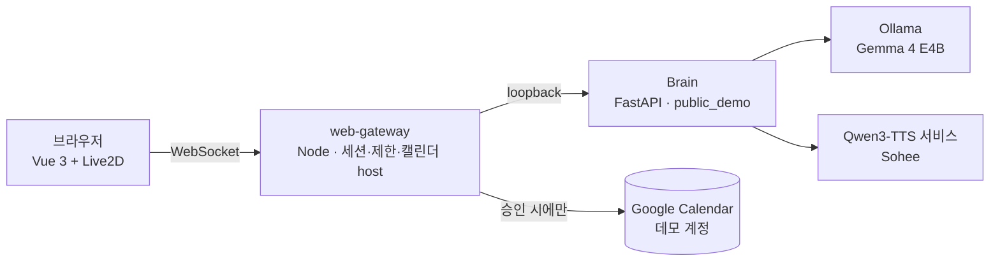

# 타냐 (Tanya) — 먼저 살피고, 말하고, 대신 움직이는 AI 동반자 웹 데모

> **체험하기:** https://tanya.serian.live (로그인 없음 · 대화는 저장되지 않음 · 개인정보 입력 금지)

타냐는 "채팅창에 답만 하는 봇"이 아니라, **사용자의 말을 듣고 → 목소리로 답하고 → 실제 일정을 대신 만들고 → 때가 되면 먼저 말을 거는** 흐름을 한 화면에서 보여 주는 대화형 캐릭터 데모입니다. 브라우저만 있으면 됩니다.


## 무엇을 체험할 수 있나

화면 상단의 **5단계 안내**를 따라가면 핵심 기능을 모두 만나게 됩니다.

| 단계 | 해 보는 것 | 뒤에서 일어나는 일 |
| --- | --- | --- |
| 1. 인사해 보기 | "안녕, 너는 누구야?" | 서버의 Gemma 4가 스트리밍으로 답하고, Qwen3-TTS가 문장 단위로 목소리를 합성해 Live2D 캐릭터가 립싱크로 말합니다 |
| 2. 일정 부탁하기 | "내일 오후 3시에 운동 일정 추가해 줘" | 모델이 자연어를 **정확한 일정 초안**(날짜·시각·시간대)으로 만들고, 카드로 보여 줍니다 — 이 시점엔 아무것도 실행되지 않습니다 |
| 3. 확인 후 승인 | 카드의 승인 버튼 | 승인한 내용 그대로 **공개 데모 캘린더에 실제로 생성**하고, 재조회로 확인한 영수증(일정 ID·Google 링크)을 돌려줍니다. 화면 아래 데모 캘린더 목록도 갱신됩니다 |
| 4. 답변 중 끼어들기 | 긴 답변 도중 "답변 중단" 또는 새 메시지 | 생성·음성이 즉시 멈추고 다음 턴으로 넘어갑니다 |
| 5. 먼저 말 걸어오기 | "10분 뒤에 스트레칭 일정 추가해 줘" 승인 | 시작 시각이 다가오면 타냐가 **먼저** 카드를 띄워 준비를 묻습니다(이 세션이 승인한 일정만) |

| 목소리로 답하는 타냐 | 일정 초안 카드(승인 전엔 실행 없음) | 승인 뒤 영수증과 데모 캘린더 목록 |
| --- | --- | --- |
|  |  |  |

다섯 단계를 마치면 요약 팝업이 뜨고, **"체험 끝내기"**를 누르면 이 세션이 만든 데모 일정은 즉시 삭제됩니다. 승인하지 않은 일정은 만들어지지 않고, 만들어진 데모 일정도 약 60분 뒤 자동으로 지워집니다.

## 설계에서 신경 쓴 것

- **승인 없는 실행은 없다.** 모델은 초안만 제안할 수 있고, 실제 쓰기는 사람이 카드에서 승인했을 때만 게이트웨이가 수행합니다. 실행 뒤에는 반드시 재조회해 "정말 만들어졌는지"를 영수증으로 증명합니다.
- **방문자 데이터는 남기지 않는다.** 공개 Brain은 `public_demo` 모드로 tmpfs에서만 동작하고, 세션이 끝나면 대화가 삭제됩니다. 방문자의 Google 계정에는 접근하지 않습니다(데모 캘린더는 운영자 소유).
- **한 명의 체험을 다른 사람이 망치지 못하게.** 네트워크당 동시 세션·시간당 세션 수·세션당 30턴·메시지 500자·유휴 10분 제한, 동시 생성 슬롯 상한(초과 시 즉시 "혼잡" 안내).
- **말하는 캐릭터.** 문장 단위 합성 → 순차 재생 → 립싱크·표정 프리셋 → 자막. 모델 파일을 방문자가 추가하는 기능은 없습니다(고정 캐릭터 1개).

## 구조



| 패키지 | 역할 |
| --- | --- |
| `packages/web` | Vite + Vue 3 브라우저 앱. 데스크톱 앱의 대화·캐릭터·재생 컴포넌트를 그대로 재사용하고, 안내 단계·초안/영수증/선제 제안 카드·모바일 레이아웃을 더함 |
| `packages/web-gateway` | 방문자 세션 토큰, 브라우저↔Brain 프로토콜 중계(허용 목록 기반), 제한, 캘린더 도구 host(초안 → 승인 → 실행 → 영수증), 선제 제안, 정적 서빙 |
| `packages/brain` | Python/FastAPI Brain. 모델 라우팅, 도구 제안 프로토콜, 문장 분할·음성 합성 요청, `public_demo` 모드의 접근 제한 |
| `packages/contracts` | 브라우저·게이트웨이·Brain이 공유하는 프로토콜 스키마(JSON Schema → TS/Python) |
| `packages/desktop`, `packages/client` | 개인용 데스크톱 앱(Electron)과 공용 렌더러. 웹 데모는 이 코드의 컴포넌트를 재사용 |
| `deploy/web`, `deploy/qwen3-tts` | 서버 배포 준비물(systemd 유닛, 설치 스크립트, host 설정 예시) |

## 모델과 기술

| 구성 | 사용한 것 | 비고 |
| --- | --- | --- |
| 대화 | `google/gemma-4-e4b-it` (Unsloth GGUF Q4_K_M, Ollama) | Apache-2.0 + Gemma 금지 사용 정책. 8 GB GPU에서 음성 모델과 함께 상주하도록 양자화·메모리 조정 |
| 음성 | Qwen3-TTS 0.6B CustomVoice, 기본 제공 한국어 음성 `Sohee` | Apache-2.0. 별도 학습·음성 복제 없음. 문장 단위 합성, 앞뒤 무음 트리밍 |
| 캐릭터 | Live2D Cubism SDK for Web + 샘플 모델 Mao(니지이로 마오) | Live2D 라이선스(아래 고지) |
| 도구 실행 | Google Calendar API (운영자 데모 계정) | 승인 뒤에만 쓰기, 재조회로 검증, 자동 삭제 |
| 프런트/백 | Vue 3 · TypeScript · Node 24 · Python 3.12 · FastAPI | 모든 통신은 JSON Schema로 검증 |

## 이 저장소에 포함되지 않는 것

이 저장소는 개발 저장소의 **소스 스냅샷**이며, 아래는 라이선스·권리 사유로 제외했습니다. 출처 표기는 해당 자료의 이용 허락이나 재배포 허락을 뜻하지 않습니다.

- **Live2D Cubism Core·Web Framework** — Live2D 전용/오픈 소프트웨어 라이선스. 공식 SDK에서 받아 `packages/client/public/live2d/{core,framework}`, `packages/client/vendor/cubism-framework`에 배치합니다.
- **Live2D 샘플 캐릭터 파일(Mao·Hiyori)** — Free Material License는 자료 재배포를 금지합니다. 공식 샘플을 받아 `packages/web/live2d-samples/Mao/`에 배치합니다(`packages/web/live2d-profiles/*/README.md`).
- 개발 중인 오리지널 캐릭터, 이전 음성 학습 자료, 운영 설정·자격증명.

제3자 코드·모델·자산의 고지는 [THIRD_PARTY_NOTICES.md](THIRD_PARTY_NOTICES.md)에, 방문자용 고지는 데모 페이지의 "고지 및 이용 조건"에 있습니다.

## 직접 실행해 보기

```sh
# 브라우저 앱(타냐 프로파일)과 게이트웨이 번들
npm --prefix packages/web install && VITE_WEB_PROFILE=tanya npm --prefix packages/web run build
npm --prefix packages/web-gateway install && npm --prefix packages/web-gateway run bundle

# 배포 폴더 만들기 (Brain 소스·고정 requirements·유닛·설치 스크립트 포함)
node deploy/web/prepare_release.mjs
```

서버 쪽은 `deploy/web/README.md`(Brain·게이트웨이)와 `deploy/qwen3-tts/README.md`(음성 서비스, 실측 표 포함)를 따릅니다. Ollama에 대화 모델을 받아 두고, `deploy/web/public-host.json`에서 모델·음성 엔드포인트를 지정합니다. 캘린더 실행은 기본값이 `handoff`(방문자 캘린더에 담는 링크·ICS)이며, `google_demo`는 운영자 데모 계정 인가(`npm run authorize`)가 필요합니다.

테스트: `packages/brain`의 `pytest tests/test_rearchitecture_*.py`, `packages/web-gateway`·`packages/web`의 `npm test`, `deploy/qwen3-tts/tests`.

## 알려진 한계

- 음성은 합성이 실시간보다 조금 느려(RTF ≈ 1.1) 긴 답변에서는 문장 사이에 짧은 틈이 생깁니다.
- 음성 입력(마이크)은 이 데모에 없습니다.
- 대화 모델은 일정 요청을 가끔 되묻습니다. "응, 그대로 준비해 줘"라고 답하면 초안이 만들어집니다.
- 8 GB GPU 한 장에서 대화·음성 모델을 함께 돌리므로 동시 체험 인원이 늘면 대기 시간이 길어집니다.

## 만든 방법

개인 프로젝트로, 설계·구현·검증에 AI 코딩 도구(Claude Code, OpenAI Codex)를 함께 썼습니다. 제품 안의 모델은 위 표와 같고, 실측·라이선스 확인 결과는 각 `deploy/*/README.md`와 `THIRD_PARTY_NOTICES.md`에 남겼습니다.
